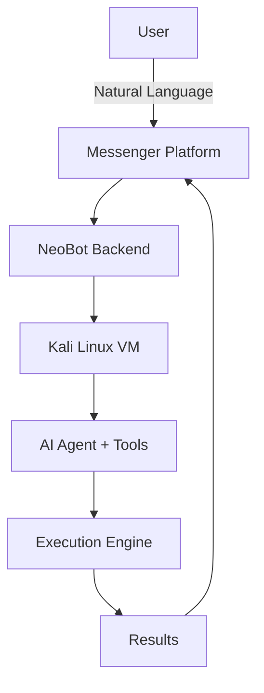

# NeoBot

**Enterprise-Grade AI-Powered Cybersecurity Automation Platform**

<div align="center">
  
  
  <p><strong>One-Click Kali Linux VM Provisioning • Autonomous AI Agent • Real-time Messenger Control</strong></p>
  
  <p>
    <a href="#-download-now">Download Now</a> •
    <a href="#-features">Features</a> •
    <a href="#-quick-start">Quick Start</a> •
    <a href="#-architecture">Architecture</a>
  </p>
</div>

---

## What is NeoBot?

**NeoBot** is a production-ready, cross-platform desktop application that delivers **zero-touch deployment** of a fully hardened Kali Linux virtual machine with an embedded autonomous AI agent. Control everything through natural language via WhatsApp, Telegram, or Signal.

Built for ethical hackers, red teamers, and security researchers who demand speed, security, and automation.

## Download Now

<div align="center">

**Choose your platform below** or visit the **[beautiful download page](https://iofhouras.github.io/neobot/download.html)** for a guided experience.

| Platform   | Direct Download                                                                 | Recommended |
|------------|----------------------------------------------------------------------------------|-------------|
| **Windows** | [⬇️ Download Setup.exe](https://github.com/iofhouras/neobot/releases/latest/download/NeoBot-Setup.exe) | Best for most users |
| **macOS**   | [⬇️ Download Universal.dmg](https://github.com/iofhouras/neobot/releases/latest/download/NeoBot-0.1.0.dmg) | Apple Silicon + Intel |
| **Linux**   | [⬇️ Download AppImage](https://github.com/iofhouras/neobot/releases/latest/download/NeoBot-x86_64.AppImage) | Portable & easy |

**Don't know which one?** → [Go to the Smart Download Page](https://iofhouras.github.io/neobot/download.html) *(auto-detects your device)*

</div>

---

## Key Features

| Category              | Highlights |
|-----------------------|----------|
| **Zero-Touch Provisioning** | Fully automated VM creation, hardening, and AI agent deployment in under 15 minutes |
| **AI Agent Orchestration** | Persistent, conversational AI agent controllable via WhatsApp, Telegram, Signal |
| **Enterprise Security** | Encrypted credential vault, zero-trust architecture, sandboxed execution |
| **Toolchain Automation** | 15+ pre-installed pentesting tools with intelligent orchestration |
| **Cross-Platform** | Native builds for Windows, macOS, and Linux with professional installers |
| **Real-time Control** | Bidirectional messaging with low-latency command execution |

## Quick Start

### 1. Download & Install

Download the version for your operating system above, then run the installer.

### 2. Run the Setup Wizard

Launch NeoBot and follow the guided 5-step wizard:
1. System Check
2. VM Configuration
3. AI Agent Setup (Grok + Messenger keys)
4. Zero-Touch Provisioning
5. Launch

### 3. Start Using

Message your AI agent on WhatsApp or Telegram:

> "Run a full reconnaissance on target.example.com"

## Architecture



**Core Components:**
- **Frontend**: SvelteKit + Tailwind + shadcn/ui (Cyberpunk theme)
- **Backend**: Rust + Tauri 2 (secure, lightweight)
- **VM Layer**: VirtualBox with automated provisioning
- **AI Layer**: Grok + extensible tool system (OpenClaw-inspired)

## Project Structure

```
neobot/
├── src-tauri/              # Rust backend
│   ├── src/
│   ├── commands/         # Tauri commands
│   ├── core/             # Terminal, security, AI
│   ├── provisioning/     # Zero-touch engine
│   ├── ai_agent/         # Agent orchestration
├── frontend/               # SvelteKit UI
├── assets/                 # Icons, logos
├── docs/                   # Documentation
└── .github/                # Workflows, templates
```

## Roadmap

- [x] Core VM Provisioning Engine
- [x] AI Agent Framework
- [x] Multi-Platform Support
- [ ] Full Messenger Integration (WhatsApp + Telegram)
- [ ] Vector Memory + Long-term Context
- [ ] Plugin Marketplace
- [ ] Enterprise SSO & Audit Logging
- [ ] Mobile Companion App

## Contributing

We welcome contributions! Please read our [Contributing Guidelines](CONTRIBUTING.md) before submitting PRs.

## Security & Ethics

**NeoBot is designed exclusively for authorized penetration testing and ethical security research.**

- All actions require explicit user confirmation
- Encrypted credential storage
- Full audit logging
- Never use against systems you do not have permission to test

## License

This project is licensed under the MIT License — see the [LICENSE](LICENSE) file for details.

---

<div align="center">
  <p>Made with ❤️ by the NeoBot Team</p>
  <p>Questions? Open an issue or join our discussions.</p>
</div>