  

# NeoBot
**The world's greatest local persistent AI GitHub developer platform**

> Phase 3 Complete: Full Tauri Desktop App • Persistent LangGraph Agent • Tool Executor • GitHub Developer Mode • Beautiful Cyberpunk Svelte UI

---

## 🚀 Overview

NeoBot is the ultimate autonomous AI-powered GitHub developer that runs **locally and persistently** on your machine. It features a stunning cyberpunk-themed Tauri 2 desktop app (SvelteKit + shadcn/ui), one-click Kali Linux VM provisioning, and a powerful LangGraph-based agent with exact JSON persistent memory, reflection loops, and advanced tool capabilities including Playwright browser automation, guarded system commands, self-extension via dynamic skills, and full GitHub integration (PRs, repo edits, commits).

Built for developers who want an AI that **actually gets work done** on their repos — safely, persistently, and with full control.

---

## ✨ Phase 3 Core Features (Now Live)

- **Stunning Desktop UI**: Tauri 2 + SvelteKit cyberpunk theme with Control Panel (Agent Launch, Memory Export, Self-Improvement, GitHub Dev Tab, live logs)
- **One-Click Provisioning**: VirtualBox Kali VM auto-setup + zero-touch agent install (Qdrant + Mem0 + LangGraph + Playwright)
- **Persistent Agent Core**: LangGraph + Reflection Loop with Exact JSON Block Memory
- **Advanced Tool Executor**: 
  - Browser Automation (Playwright)
  - Guarded System Commands (risk confirmation)
  - Self-Extension (dynamic skill installation)
  - GitHub Developer Mode (create PRs, edit files, commit, push)
- **Robust CI/CD**: GitHub Actions test workflow for the agent
- **Professional Documentation**: Full integration guide

---

## 🏗️ Architecture

```mermaid
graph TD
    subgraph "Desktop Layer"
        A[NeoBot Tauri 2 App<br/>SvelteKit + shadcn/ui Cyber Theme]
    end
    subgraph "Provisioning Layer"
        B[One-Click VirtualBox<br/>Kali VM Setup]
        C[Zero-Touch Agent Install<br/>Qdrant + Mem0 + LangGraph + Playwright]
    end
    subgraph "Agent Core (Kali VM)"
        D[LangGraph + Reflection Loop]
        E[Persistent Memory<br/>Exact JSON Block]
        F[Tool Executor]
    end
    subgraph "Tool Capabilities"
        G[Browser Automation<br/>Playwright]
        H[Guarded System Commands<br/>Risk Confirmation]
        I[Self-Extension<br/>Dynamic Skill Installation]
        J[GitHub Developer Mode<br/>PRs • Repo Edits • Commits]
    end
    A -->|Launch| B
    B -->|Auto-config| C
    C --> D
    D --> E
    D --> F
    F --> G
    F --> H
    F --> I
    F --> J
    A -->|UI Controls| K[NeoBot Control Panel<br/>Memory Export • Self-Improve • Dashboard]
    style A fill:#0a0a0a,stroke:#00ff9d,color:#00ff9d
    style D fill:#001a00,stroke:#00b8ff,color:#00b8ff
    style F fill:#0a0a0a,stroke:#00ff9d
```

---

## 🛠️ Getting Started

1. **Clone & Build** (or download release)
2. **Launch NeoBot** — One-click starts the Tauri app and provisions the Kali VM
3. **Use the Control Panel** — Launch agent, export memory, trigger self-improvement, or use GitHub Dev mode
4. **Interact** — The agent runs persistently with full memory and tool access

See `docs/neobot-integration.md` for detailed setup.

---

## 📦 What's Next (Phase 4)

- Full GitHub Developer Dashboard UI enhancements
- Installer bundling + v1.0 release
- Multi-user memory features

---

**All changes committed on `phase3-logo-architecture` branch.**  
Ready for merge to `main`.

---

  
<strong>NeoBot</strong> — Local • Persistent • Unstoppable AI GitHub Developer

