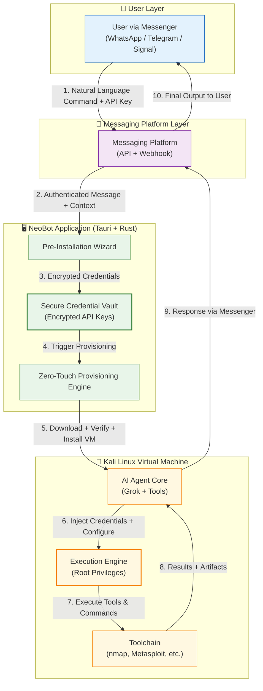

# NeoBot

**Enterprise-Grade AI-Powered Cybersecurity Automation Platform**

  
  
  <h2>One-Click Kali Linux VM + Autonomous AI Agent</h2>
  
  
<strong>Control everything through WhatsApp, Telegram, or Signal</strong>

---

## ⬇️ Download NeoBot

### ✨ Best Experience: Visit the Official Download Page

<a href="https://iofhouras.github.io/neobot/download.html" style="display: inline-block; background: linear-gradient(90deg, #00ff9d, #00b8ff); color: #0a0a0a; padding: 18px 40px; border-radius: 50px; text-decoration: none; font-weight: bold; font-size: 20px; box-shadow: 0 10px 30px rgba(0, 255, 157, 0.4); transition: transform 0.2s;">
    🚀 Open Beautiful Download Page
</a>

<em>Auto-detects your device + beautiful cyberpunk design</em>

### Or Download Directly

| Platform   | Direct Link                                                                 | 
|------------|-----------------------------------------------------------------------------|
| **Windows** | [Download Setup.exe](https://github.com/iofhouras/neobot/releases/latest/download/NeoBot-Setup.exe) |
| **macOS**   | [Download Universal.dmg](https://github.com/iofhouras/neobot/releases/latest/download/NeoBot-0.1.0.dmg) |
| **Linux**   | [Download AppImage](https://github.com/iofhouras/neobot/releases/latest/download/NeoBot-x86_64.AppImage) |

---

## What is NeoBot?

**NeoBot** is a production-ready, cross-platform desktop application that delivers **zero-touch deployment** of a fully hardened Kali Linux virtual machine with an embedded autonomous AI agent.

Control the AI agent using natural language through WhatsApp, Telegram, or Signal.

## System Architecture

**Architecture Highlights:**
- **Layered Design** with clear security boundaries
- **End-to-End Encryption** for credentials and communication
- **Zero-Trust Model** with API key validation at every step
- **Autonomous Execution** inside isolated Kali Linux VM with root privileges
- **Real-time Bidirectional Flow** between user and AI agent

## Key Features

| Category                    | Description |
|-----------------------------|-----------|
| **Zero-Touch Provisioning** | Fully automated VM creation + AI agent deployment in under 15 minutes |
| **Conversational AI Agent** | Control via WhatsApp, Telegram, or Signal using natural language |
| **Enterprise Security**     | Encrypted credential vault + zero-trust architecture |
| **Advanced Toolchain**      | 15+ pre-installed pentesting tools with intelligent orchestration |
| **Cross-Platform**          | Native apps for Windows, macOS, and Linux |

## Quick Start

1. **Download** the version for your platform above
2. **Run the installer** and follow the 5-step wizard
3. **Configure** your AI agent (Grok API + Messenger)
4. **Launch** your fully provisioned Kali Linux VM

## Roadmap

- [x] Core VM + AI Agent System
- [x] Multi-Platform Support
- [ ] Full WhatsApp + Telegram Integration
- [ ] Vector Memory & Long-term Context
- [ ] Plugin Marketplace

## Contributing

Contributions are welcome! See [CONTRIBUTING.md](CONTRIBUTING.md)

## Security & Ethics

**For authorized penetration testing and ethical security research only.**

## License

MIT License

---

  
<strong>Ready to get started?</strong> Click the big green button above.

