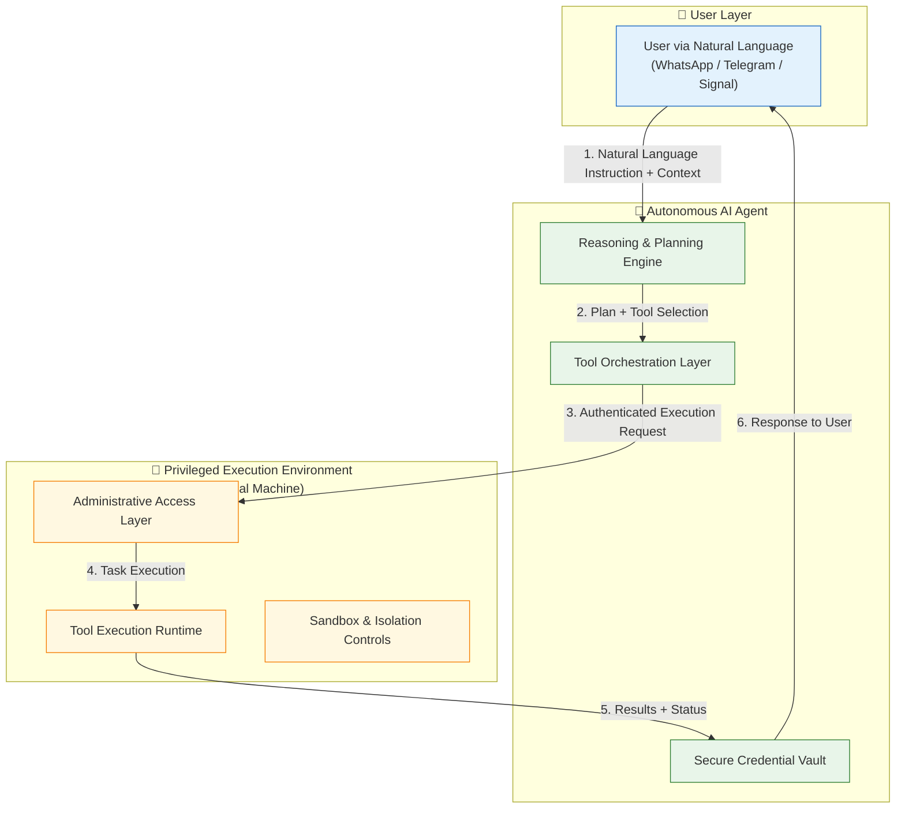

# NeoBot

**Autonomous AI Agent Assistant for Intelligent Task Automation**

  
  
  <h2>Intelligent Goal-Oriented Automation Powered by a Privileged Virtual Execution Environment</h2>
  
  
<strong>Autonomous AI Agent • Natural Language Interface • Robust Linux Runtime</strong>

  
  

    <a href="#-download-neobot"><strong>⬇️ Download Now</strong></a> •
    <a href="#-core-features">Features</a> •
    <a href="#-how-it-works">How It Works</a>
  

---

## ⬇️ Download NeoBot

### ✨ Recommended: Visit the Official Download Page

<a href="https://iofhouras.github.io/neobot/download.html" style="display: inline-block; background: linear-gradient(90deg, #00ff9d, #00b8ff); color: #0a0a0a; padding: 18px 40px; border-radius: 50px; text-decoration: none; font-weight: bold; font-size: 20px; box-shadow: 0 10px 30px rgba(0, 255, 157, 0.4); transition: transform 0.2s;">
    🚀 Open Download Page
</a>

<em>Auto-detects your device + guided setup experience</em>

### Direct Downloads

| Platform   | Download Link                                                                 | 
|------------|-------------------------------------------------------------------------------|
| **Windows** | [Setup.exe](https://github.com/iofhouras/neobot/releases/latest/download/NeoBot-Setup.exe) |
| **macOS**   | [Universal.dmg](https://github.com/iofhouras/neobot/releases/latest/download/NeoBot-0.1.0.dmg) |
| **Linux**   | [AppImage](https://github.com/iofhouras/neobot/releases/latest/download/NeoBot-x86_64.AppImage) |

---

## Overview

**NeoBot** is an autonomous AI agent assistant designed for intelligent, goal-oriented task automation. It combines advanced agentic reasoning with a powerful, fully privileged virtual execution environment, enabling reliable and sophisticated workflow orchestration through natural language interaction.

The system interprets complex user instructions, plans multi-step tasks, orchestrates appropriate tools, and executes them autonomously within a secure, sandboxed Linux runtime. This architecture enables seamless human-AI collaboration while maintaining strong isolation and operational reliability.

## Core Features

- **Autonomous Task Interpretation & Execution** — Receives, interprets, and autonomously executes complex multi-step instructions using advanced reasoning and planning capabilities.
- **Agentic Intelligence** — Features iterative self-correction, tool-use orchestration, and adaptive problem-solving for reliable goal achievement.
- **Natural Language Interface** — Interact with the agent through familiar messaging platforms (WhatsApp, Telegram, Signal) using everyday language.
- **Privileged Virtual Execution Environment** — Operates within a fully provisioned Kali Linux virtual machine, providing comprehensive administrative access and a robust Linux-based runtime for task fulfillment.
- **Seamless Human-AI Collaboration** — Supports iterative refinement, context preservation, and real-time feedback between user and agent.
- **Extensible Tool Orchestration** — Dynamically discovers and leverages a wide range of tools and capabilities within the execution environment.

## How It Works

1. **User Interaction** — The user communicates with NeoBot through a supported messaging platform using natural language.
2. **Agent Reasoning** — The AI agent interprets the request, develops a plan, and determines the necessary steps and tools.
3. **Secure Execution** — Tasks are executed within the privileged Kali Linux virtual machine with full administrative capabilities.
4. **Result Delivery** — The agent returns results, status updates, or requests clarification through the same messaging channel.
5. **Iterative Collaboration** — The user can provide feedback or additional instructions to refine outcomes.

## Technical Architecture

## Getting Started

### 1. Download & Install
Download the appropriate installer for your platform from the links above.

### 2. Initial Setup
Launch NeoBot and complete the guided setup wizard:
- Configure your preferred messaging platform
- Set up the AI agent credentials
- Provision the virtual execution environment

### 3. Start Using
Begin interacting with your autonomous AI agent through your chosen messaging platform using natural language.

## Use Cases

**Professional Automation Scenarios**
- Complex multi-step workflow orchestration
- Intelligent data processing and analysis pipelines
- Automated research and information synthesis
- System administration and configuration management
- Development environment setup and maintenance
- Iterative problem-solving and debugging assistance

## Roadmap

- [x] Core Autonomous Agent Framework
- [x] Privileged Virtual Execution Environment
- [x] Multi-Platform Support
- [ ] Advanced Memory & Context Management
- [ ] Plugin & Tool Marketplace
- [ ] Enterprise Integration Features

## Contributing

We welcome contributions from the community. Please see [CONTRIBUTING.md](CONTRIBUTING.md) for guidelines.

## License

This project is licensed under the MIT License.

---

  
<strong>NeoBot</strong> — Autonomous Intelligence for Goal-Oriented Automation

